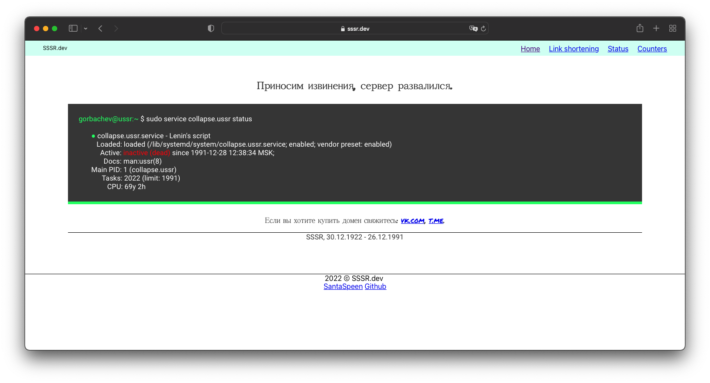

# Site SSSR.dev

<p align="center">
    
</p>

Create with `React.JS v16.13.2`

Site map:

1. Root - [sssr.dev](https://sssr.dev/?ref=github)
2. Link creator - [sssr.dev/cc](https://sssr.dev/cc?ref=github) [not ready]

### Start

```shell
# Shell

$ git clone https://github.com/sssr-dev/main.git
  # Cloning repo
$ cd site
$ npm i
  # Install all dependents
$ npm start
  # Start develop server
  
```